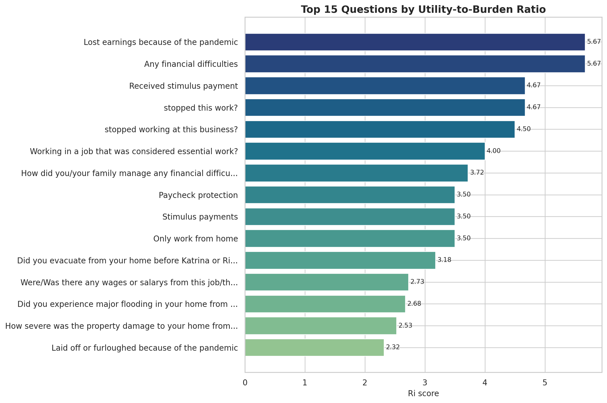
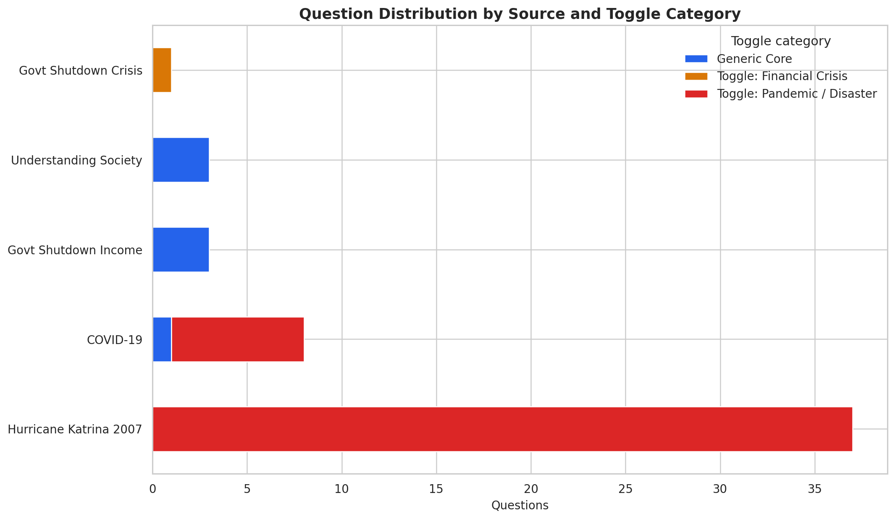
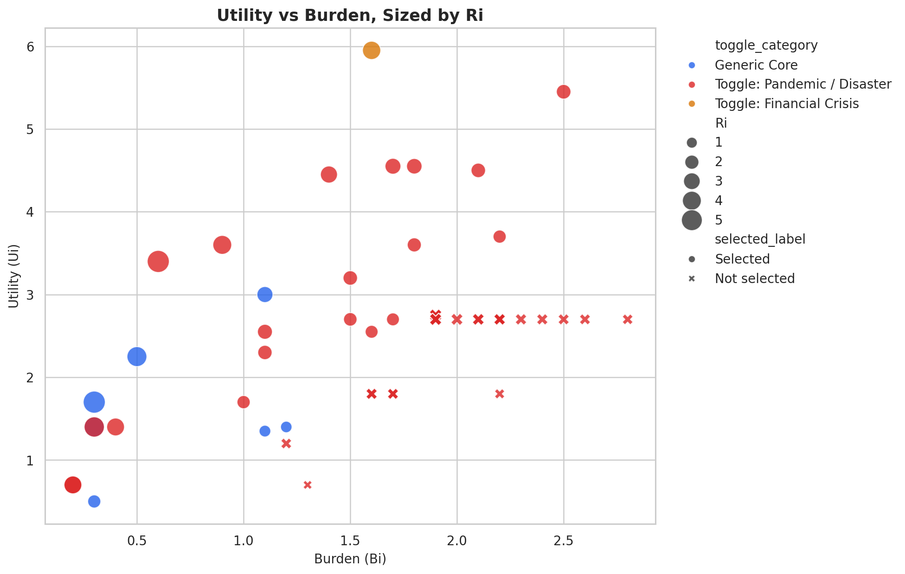
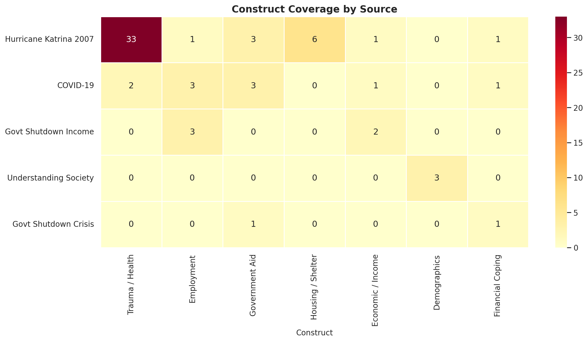
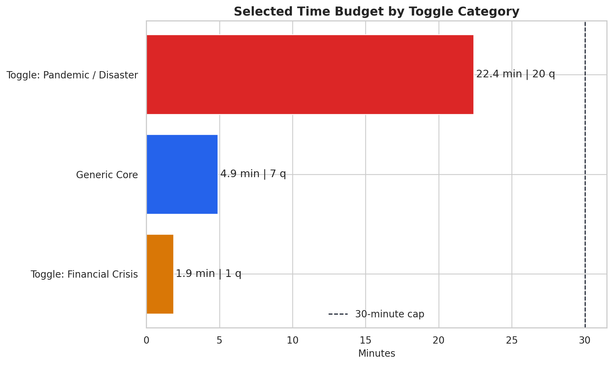

# PANEL STUDY OF INCOME DYNAMICS

## Generic Crisis Module: NLP Optimization and Question Ranking Report

Prepared for: Thomas Crossley, PSID Director  
Prepared by: Team PSID - Survey Methodology Group  
Date: March 2026

---

## 1. Executive Summary

This refreshed report summarizes the current artifact set generated from the final ranked output file and the notebook-linked refresh step. The pipeline now uses the Katrina-integrated ranked dataset as the authoritative source, regenerates figures directly from that file, and keeps the dashboard, notebook refresh cell, and report aligned.

### Current headline results

- Total historical questions processed: 52
- Questions selected for the final module: 28
- Estimated time for selected module: 29.17 minutes
- Estimated time for all 52 questions: 68.95 minutes
- Total extracted keywords: 324
- Total taxonomy-tagged matches: 160
- Questions with construct coverage: 52
- Keywords across selected questions: 141
- Tagged matches across selected questions: 96
- Average utility-to-burden score across all questions: 2.079
- Maximum utility-to-burden score: 5.667

The selected module remains within the 30-minute hard cap while preserving a 7-question Generic Core and a crisis-specific expansion dominated by the Pandemic / Disaster bank.

---

## 2. Data Sources and Selection Outcome

The integrated corpus contains 52 ranked questions drawn from five PSID-related sources.

| Source | Total questions | Selected questions |
| --- | ---: | ---: |
| Hurricane Katrina 2007 | 37 | 13 |
| COVID-19 | 8 | 8 |
| Govt Shutdown Income | 3 | 3 |
| Understanding Society | 3 | 3 |
| Govt Shutdown Crisis | 1 | 1 |
| Total | 52 | 28 |

### Toggle distribution

| Toggle category | Total questions | Selected questions |
| --- | ---: | ---: |
| Toggle: Pandemic / Disaster | 44 | 20 |
| Generic Core | 7 | 7 |
| Toggle: Financial Crisis | 1 | 1 |

### Construct coverage in the selected set

| Construct | Selected question count |
| --- | ---: |
| Trauma / Health | 13 |
| Employment | 7 |
| Government Aid | 5 |
| Housing / Shelter | 5 |
| Economic / Income | 4 |
| Financial Coping | 3 |
| Demographics | 3 |

These counts confirm that the Katrina integration materially strengthened housing, trauma, and aid coverage while preserving the high-performing work and financial coping items identified in the earlier shutdown and COVID materials.

---

## 3. Method Summary

Questions are scored using the utility-to-burden ratio

$$
R_i = \frac{U_i}{B_i}
$$

where $U_i$ is derived from taxonomy-matched crisis keywords and $B_i$ penalizes question length and structural complexity. The configured burden and duration constants remain:

| Constant | Value | Purpose |
| --- | ---: | --- |
| `ALPHA` | 0.10 | Word-count burden coefficient |
| `BETA` | 0.20 | Complexity burden coefficient |
| `SECS_PER_WORD` | 7 | Estimated completion time per word |
| `MAX_SECONDS` | 1800 | Hard 30-minute cap |

The final ranked file stores the downstream selection decision in `selected_for_module`, allowing the artifact refresh step to regenerate all summary figures and dashboard data from one source of truth.

---

## 4. Time Budget Assessment

The current selected module uses 29.17 minutes, leaving a small margin below the 30-minute ceiling.

| Module component | Selected questions | Estimated minutes |
| --- | ---: | ---: |
| Generic Core | 7 | 4.87 |
| Toggle: Financial Crisis | 1 | 1.17 |
| Toggle: Pandemic / Disaster | 20 | 23.13 |
| Total selected | 28 | 29.17 |

This confirms the target architecture remains operational:

- A short, stable Generic Core that can always be fielded.
- A very small Financial Crisis add-on for shutdown or recession-type events.
- A much richer Pandemic / Disaster add-on for health emergencies and physical shocks.

---

## 5. Figures Regenerated From the Final Dataset

### Figure 1. Top-ranked selected questions

This chart highlights the highest-ranked items by $R_i$. Financial hardship, income loss, and work interruption remain at the top of the ranking, with Katrina and COVID questions contributing the strongest crisis-specific additions.

### Figure 2. Toggle comparison across the selected module

The selected set is still dominated by the Pandemic / Disaster toggle because Katrina contributed many high-value housing, displacement, trauma, and aid questions that remain efficient enough to fit under the time cap.

### Figure 3. Utility versus burden profile

The scatter confirms that the top selected items combine high information utility with manageable respondent burden. Several short COVID and shutdown questions sit in the most favorable high-utility, low-burden region.

### Figure 4. Construct heatmap for the selected module

The heatmap shows that the final module is no longer purely economic. Trauma / Health, Housing / Shelter, and Government Aid are now strongly represented alongside Employment and Financial Coping.

### Figure 5. Time budget breakdown

The final selected questionnaire consumes nearly the full available budget, but remains compliant. The major time share is the Pandemic / Disaster bank, which is expected because Katrina-style questions are longer and more detailed.

---

## 6. Deliverable Alignment

The refreshed artifact workflow now keeps the following outputs consistent:

- `generate_psid_artifacts.py` regenerates figures, summary JSON, and browser-ready dashboard data.
- `PSID_NLP_Crisis_Module_Final.ipynb` now contains an artifact refresh cell that runs the same generation path.
- `PSID_Crisis_Module_Dashboard.html` reads `psid_dashboard_data.js` instead of relying on stale hard-coded rows.
- `PSID_Generic_Module_Questionnaire.html` and `PSID_Crisis_Specific_Questionnaire_Demo.html` now present longer, stakeholder-facing questionnaire demos.
- `PSID_Module_Questionnaire_Master.html` provides a single entry point that shows both questionnaire demos together for side-by-side review.

---

## 7. Interpretation

Three conclusions remain stable after the full refresh.

1. The Generic Core is intentionally small. The ranked model continues to identify only 7 always-on questions that are consistently efficient across crisis types.
2. Katrina materially changes the module. The natural disaster items bring strong housing, displacement, and trauma content that raises the value of the Pandemic / Disaster bank.
3. The final module is tight but viable. At 29.17 minutes, the selected set is close to the cap and should be treated as the upper bound for full deployment.

---

## 8. Recommendations

1. Keep the ranked 28-question analytic module as the production benchmark, but use the longer HTML demos for stakeholder communication and questionnaire review.
2. Preserve the 7-question Generic Core analytically, while allowing the front-end demo materials to present a richer generic lead-in.
3. Use the notebook refresh cell and `generate_psid_artifacts.py` as the only supported path for future report and dashboard regeneration.
4. If the full Pandemic / Disaster module must be shortened further, start by reviewing the longest Katrina-derived items rather than trimming the Generic Core.
