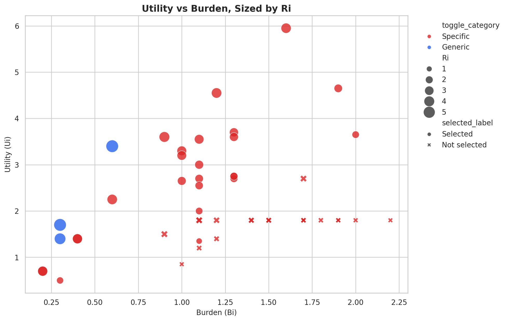
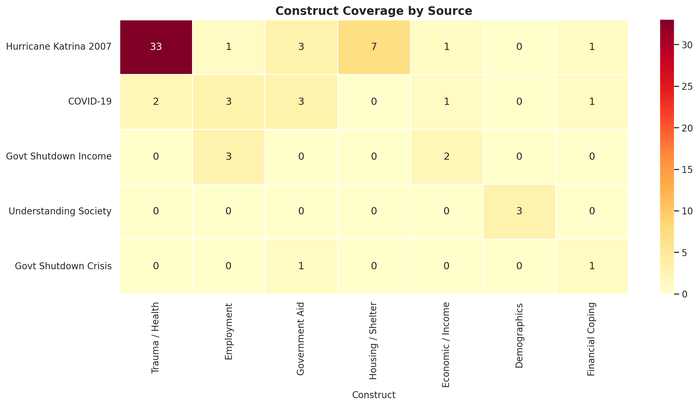
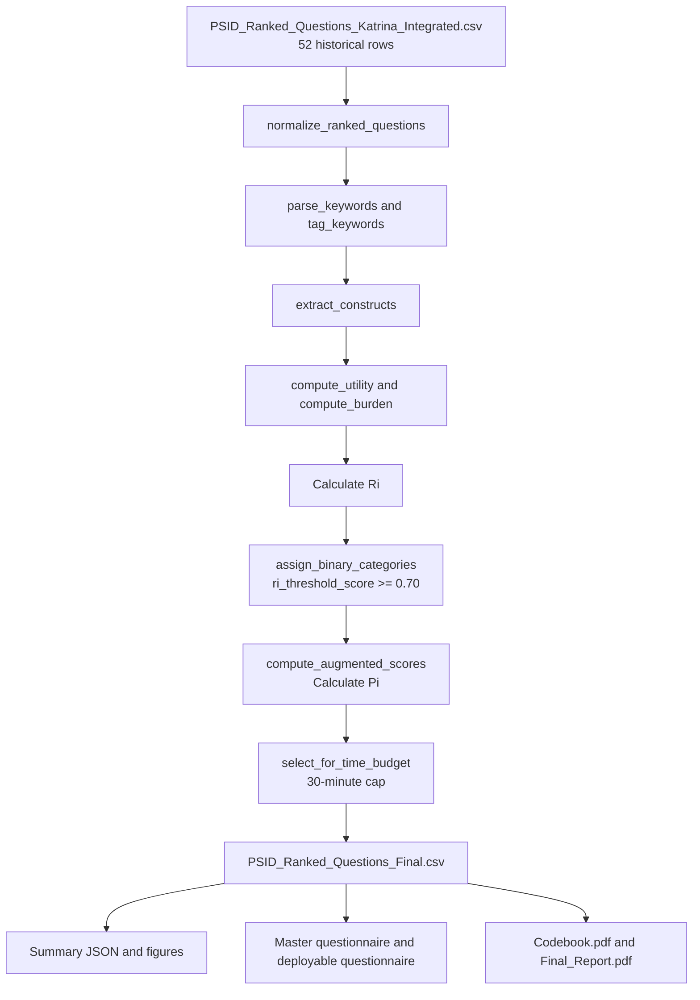

# Client 1 - Technical Codebook

Prepared for client review  
Updated: April 2026

## 1. Purpose and Scope

This document is the technical codebook for the refreshed PSID crisis-module workflow. It explains how the ranked question bank is rebuilt, how the final binary category model is assigned, how the shortlist is selected under the time cap, and how the final client package is produced.

This version reflects the current production state:

- 52 ranked historical questions in the final corpus
- 28 selected questions in the scored module
- 3 `Generic` rows and 49 `Specific` rows after binary thresholding
- 29.98 selected minutes across the full scored module
- 2 demographic traceability rows retained in the master view but excluded from the deployable instrument

## 2. Headline Benchmark Summary

| Metric | Value |
| --- | ---: |
| Total ranked questions | 52 |
| Selected questions | 28 |
| Selected minutes | 29.98 |
| Full corpus minutes | 68.60 |
| Generic rows | 3 |
| Specific rows | 49 |
| Average Ri | 2.201 |
| Maximum Ri | 5.667 |
| Average Pi | 2.561 |
| Maximum Pi | 7.860 |

## 3. Figures

### 3.1 Top-ranked questions


### 3.2 Utility versus burden



### 3.3 Construct coverage heatmap



## 4. End-to-End Workflow Pipeline



## 5. Files and Roles

| File | Role | Why it matters |
| --- | --- | --- |
| `PSID_Ranked_Questions_Katrina_Integrated.csv` | Raw integrated source bank | Starting point for every production rebuild. |
| `PSID_NLP_Crisis_Module_Structure.py` | Shared scoring helpers | Holds constants, keyword parsing, burden logic, threshold helpers, and selection utilities. |
| `generate_psid_artifacts.py` | Production rebuild engine | Writes the final scored CSV, summary JSON, dashboard payload, and figures. |
| `PSID_Ranked_Questions_Final.csv` | Authoritative scored output | Main ranked table used by the notebook and client deliverables. |
| `PSID_NLP_Crisis_Module_Final.ipynb` | Validation notebook | Recomputes the workflow and verifies the persisted artifact bundle. |
| `generate_client_documents.py` | Client-package renderer | Builds the spreadsheet and PDFs from the scored CSV and summary JSON. |
| `psid_artifact_summary.json` | Metric bundle | Stores benchmark counts and score summaries for the latest run. |

## 6. Core Scoring Logic

### 6.1 Utility, burden, and baseline rank

The baseline score is driven by question utility relative to response burden.

$$
U_i = \sum \text{keyword weights}
$$

$$
B_i = \max(0.10 \times \text{word\_count} + 0.20 \times \text{complexity}, 0.1)
$$

$$
R_i = \frac{U_i}{B_i}
$$

Interpretation:

- `Ui` rewards crisis-relevant content signaled by tagged keywords.
- `Bi` penalizes long or complex wording.
- `Ri` ranks items that carry more signal per unit of burden.

### 6.2 Binary category assignment

The client request was a binary rule:

```text
If Ri >= 0.7 -> Generic
Else -> Specific
```

That raw rule is not usable on the refreshed corpus because raw `Ri` is not constrained to `[0, 1]`. The production pipeline therefore applies the client cutoff to a min-max normalized score:

$$
\text{ri\_threshold\_score} = \frac{R_i - \min(R_i)}{\max(R_i) - \min(R_i)}
$$

Operational rule:

```text
If ri_threshold_score >= 0.70 -> Generic
Else -> Specific
```

### 6.3 Augmented priority score

The final prioritization score preserves `Ri` while rewarding breadth and distinctiveness.

$$
\text{augmented\_utility} = U_i \times (1 + 0.32 \times \text{idf\_scaled} + 0.24 \times \text{construct\_scaled} + 0.12 \times \text{richness\_scaled} + \text{portability\_bonus})
$$

$$
P_i = \frac{\text{augmented\_utility}}{B_i \times (1 + 0.65 \times \text{redundancy\_scaled})}
$$

Interpretation:

- `Pi` helps separate distinct, portable items from repetitive variants.
- The shortlist is still bounded by time budget, not only by raw rank.

## 7. Worked Calculation Example

Example question: `GEN_LOSE_EARNINGS_PANDEMIC`  
Recommended wording: `Did you lose earnings because of the pandemic?`

| Field | Value | Calculation |
| --- | ---: | --- |
| `Ui` | 3.400 | `0.80 + 0.80 + 0.90 + 0.90` |
| `word_count` | 6 | Counted from deployable wording |
| `complexity` | 0.0 | Precomputed complexity field |
| `Bi` | 0.600 | `max(0.10 * 6 + 0.20 * 0.0, 0.1)` |
| `Ri` | 5.667 | `3.40 / 0.60` |
| `ri_threshold_score` | 1.000 | `(5.667 - 0.818) / (5.667 - 0.818)` |
| Final category | `Generic` | `1.000 >= 0.70` |
| `Pi` | 7.860 | Enhanced priority after rarity, construct, richness, and redundancy adjustments |
| `minutes` | 0.70 | `(6 words * 7 seconds) / 60` |

## 8. Threshold Diagnostics

| Threshold diagnostic | Value |
| --- | ---: |
| Minimum raw `Ri` | 0.818 |
| Maximum raw `Ri` | 5.667 |
| Rows with raw `Ri >= 0.70` | 52 of 52 |
| Rows with normalized `ri_threshold_score >= 0.70` | 3 of 52 |

Interpretation:

- Raw `Ri >= 0.70` would classify every row as `Generic`.
- Normalized thresholding preserves the requested cutoff while still creating a real binary split.

## 9. Construct Coverage and Interaction Notes

### 9.1 Selected construct coverage

| Construct | Selected questions |
| --- | ---: |
| Trauma / Health | 15 |
| Employment | 7 |
| Housing / Shelter | 6 |
| Government Aid | 5 |
| Economic / Income | 4 |
| Financial Coping | 2 |
| Demographics | 2 |

### 9.2 Demographic interaction summary

| Group | Rows | Average Ri | Average Pi |
| --- | ---: | ---: | ---: |
| Demographics only | 3 | 1.354 | 2.189 |
| Non-demographic crisis items | 49 | 2.253 | 2.584 |

Interpretation:

- Demographic-only items remain useful for traceability and module framing.
- They carry less direct crisis signal than employment, housing, aid, trauma, and economic disruption items.
- That is why the final deployable questionnaire excludes demographics even though the master review file retains them.

## 10. Output Schema

| Field | Meaning |
| --- | --- |
| `variable_name` | Stable identifier used across the CSV, spreadsheet, and PDFs |
| `question_text` | Historical source wording |
| `recommended_wording` | Clean deployable wording |
| `source` | Historical module source |
| `toggle_category` | Final binary category: `Generic` or `Specific` |
| `historical_toggle_category` | Legacy category kept for traceability |
| `Ui`, `Bi`, `Ri` | Utility, burden, and baseline rank |
| `ri_threshold_score` | Normalized rank used for binary categorization |
| `Pi` | Enhanced priority score |
| `selected_for_module` | Final selection flag under the time cap |
| `minutes` | Estimated administration time |
| `constructs` | Tagged construct families |

## 11. Deliverables Produced From the Same Dataset

| Deliverable | Audience | Purpose |
| --- | --- | --- |
| `Master_Questionnaire.xlsx` | Internal review | Full 52-row review sheet with categories, wording, and scores |
| `Deployable_Questionnaire.pdf` | Survey deployment | Final question text without demographic rows |
| `Codebook.pdf` | Technical review | Rendered technical codebook |
| `Final_Report.pdf` | Stakeholder review | Narrative summary of results and interpretation |

## 12. Refresh Procedure

Use this order whenever the client package is refreshed:

1. Rebuild scored artifacts via `build_all()` in `generate_psid_artifacts.py`.
2. Validate the notebook outputs in `PSID_NLP_Crisis_Module_Final.ipynb`.
3. Regenerate the spreadsheet and PDFs through `generate_client_documents.py`.
4. Confirm that summary metrics, figures, and package files remain aligned.

That order keeps the scored CSV, the notebook, the figures, and the client documents synchronized.