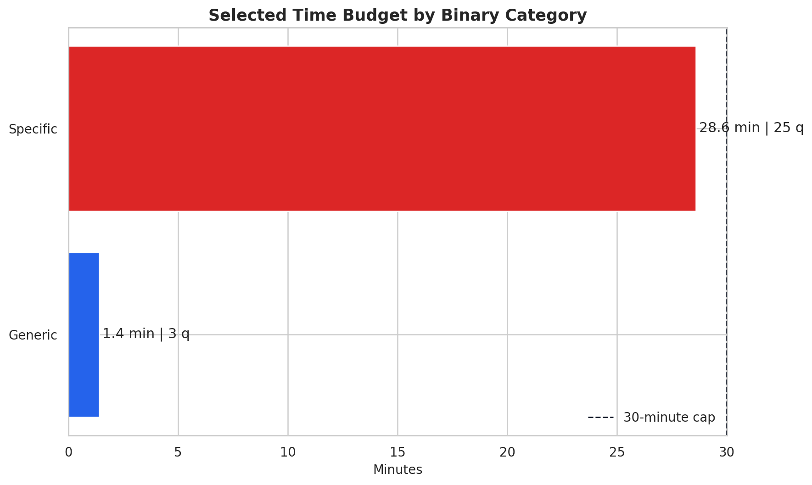
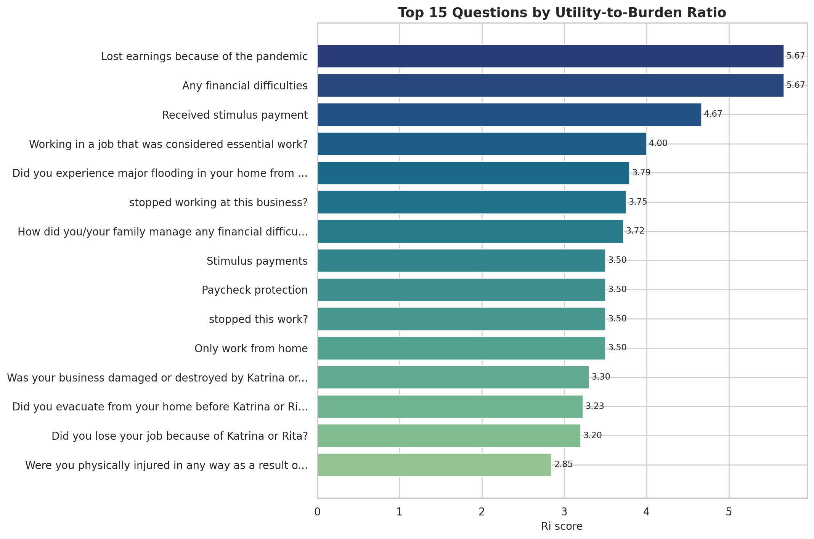
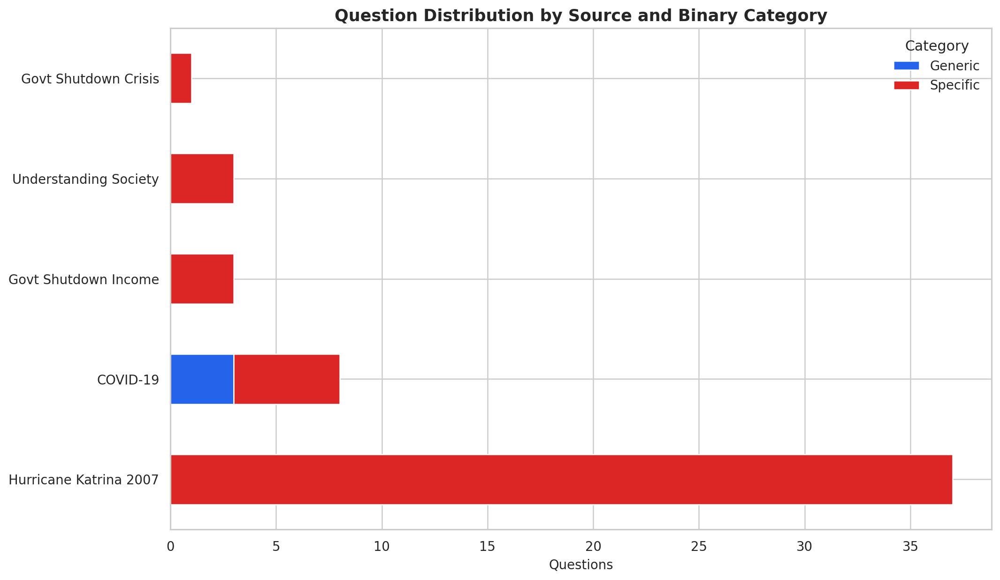
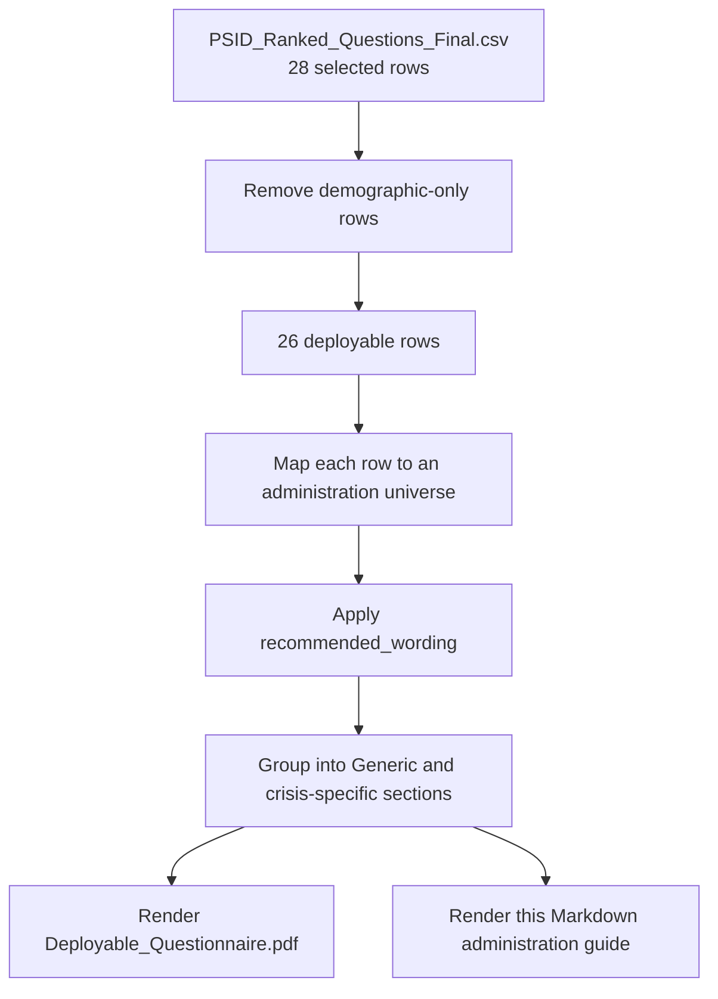

# Client 2 - Deployable Questionnaire

Prepared for client review  
Updated: April 2026

Portable PDF source: `docs/latex/client_2_deployable_questionnaire.tex`  
Compiled report: `deliverables/Client_2_Deployable_Questionnaire.pdf`

## 1. Purpose

This document is the Markdown version of the deployable questionnaire package. It translates the final scored question bank into a practical administration guide with the live question set, universe rules, timing estimates, and the ranking logic behind selection.

This deployable version excludes the two demographic traceability rows that remain in the master review file. The result is a 26-question instrument with an estimated administration time of 28.82 minutes.

## 2. Deployable Snapshot

| Metric | Value |
| --- | ---: |
| Deployable questions | 26 |
| Estimated deployable minutes | 28.82 |
| All-respondent generic questions | 3 |
| Pandemic/public-health questions | 5 |
| Shutdown/financial-disruption questions | 4 |
| Disaster/displacement/direct-exposure questions | 14 |

## 3. Figures

### 3.1 Time-budget view

### 3.2 Top-ranked question view

### 3.3 Binary category view

## 4. Deployable Workflow Pipeline

## 5. Administration Rules

### 5.1 Administration sequence

1. Ask the three all-respondent generic items.
2. Identify the active crisis context.
3. Activate one crisis-specific section based on that context.
4. Skip all sections that do not match the active crisis.

### 5.2 Universe summary

| Universe block | Rows | Minutes | Average Ri | Average Pi |
| --- | ---: | ---: | ---: | ---: |
| All respondents | 3 | 1.40 | 5.334 | 7.125 |
| Pandemic or public-health emergency | 5 | 2.92 | 3.364 | 4.393 |
| Shutdown, recession, or acute financial disruption | 4 | 4.20 | 3.424 | 4.509 |
| Disaster, displacement, or direct exposure event | 14 | 20.30 | 2.617 | 2.768 |

### 5.3 Source contribution to the deployable instrument

| Source | Rows | Minutes |
| --- | ---: | ---: |
| Hurricane Katrina 2007 | 14 | 20.30 |
| COVID-19 | 8 | 4.32 |
| Govt Shutdown Income | 3 | 2.33 |
| Govt Shutdown Crisis | 1 | 1.87 |

## 6. Formula Notes for Deployment

The deployable questionnaire still comes from the same scoring logic as the full codebook.

$$
\text{minutes} = \frac{\text{word\_count} \times 7}{60}
$$

$$
R_i = \frac{U_i}{B_i}
$$

$$
P_i = \frac{\text{augmented\_utility}}{B_i \times (1 + 0.65 \times \text{redundancy\_scaled})}
$$

Practical interpretation:

- `Ri` explains why a question is strong relative to burden.
- `Pi` helps decide which similar questions survive the time-budget cut.
- `minutes` is the operational field for questionnaire assembly.

## 7. Worked Example for a Deployable Generic Item

Example question: `GEN_LOSE_EARNINGS_PANDEMIC`

| Field | Value | Calculation |
| --- | ---: | --- |
| Question text | Did you lose earnings because of the pandemic? | Portable generic framing item |
| `Ui` | 3.400 | `0.80 + 0.80 + 0.90 + 0.90` |
| `Bi` | 0.600 | `max(0.10 * 6 + 0.20 * 0.0, 0.1)` |
| `Ri` | 5.667 | `3.40 / 0.60` |
| `Pi` | 7.860 | Enhanced priority after distinctiveness adjustments |
| `minutes` | 0.70 | `(6 * 7) / 60` |
| Administration block | All respondents | Asked before crisis-specific skips |

## 8. All-Respondent Generic Core

These questions create a portable core that can be asked before event-specific routing.

| Variable | Source | Question | Ri | Pi | Minutes |
| --- | --- | --- | ---: | ---: | ---: |
| GEN_EXPERIENCED_FINANCIAL_DIFFICULTIES_C | COVID-19 | Have you experienced any financial difficulties because of the crisis? | 5.667 | 7.187 | 0.35 |
| GEN_LOSE_EARNINGS_PANDEMIC | COVID-19 | Did you lose earnings because of the pandemic? | 5.667 | 7.860 | 0.70 |
| GEN_RECEIVE_STIMULUS_PAYMENT_OTHER | COVID-19 | Did you receive a stimulus payment or other emergency government support? | 4.667 | 6.328 | 0.35 |

## 9. Pandemic or Public-Health Emergency Block

Ask this section when the active crisis is a pandemic or other public-health emergency.

| Variable | Source | Question | Ri | Pi | Minutes |
| --- | --- | --- | ---: | ---: | ---: |
| SPC_WORK_ENTIRELY_HOME_DURING | COVID-19 | Did you work entirely from home during the crisis? | 3.500 | 3.957 | 0.47 |
| SPC_WORKING_JOB_CONSIDERED_ESSENTIAL | COVID-19 | Were you working in a job that was considered essential during the crisis? | 4.000 | 5.223 | 1.05 |
| SPC_RECEIVE_PAYCHECK_PROTECTION_OTHER | COVID-19 | Did you receive paycheck protection or other emergency business support? | 3.500 | 5.212 | 0.23 |
| SPC_RECEIVE_STIMULUS_PAYMENT_OTHER | COVID-19 | Did you receive a stimulus payment or other emergency government support? | 3.500 | 4.466 | 0.23 |
| SPC_LAID_OFF_FURLOUGHED_PANDEMIC | COVID-19 | Were you laid off or furloughed because of the pandemic? | 2.318 | 3.106 | 0.93 |

## 10. Shutdown, Recession, or Acute Financial Disruption Block

Ask this section when the active crisis is a shutdown, recession, or acute financial disruption.

| Variable | Source | Question | Ri | Pi | Minutes |
| --- | --- | --- | ---: | ---: | ---: |
| SPC_STOPPED_WORK_CRISIS | Govt Shutdown Income | Have you stopped this work because of the crisis? | 3.500 | 4.134 | 0.47 |
| SPC_WAGES_SALARY_PAYMENTS_JOB | Govt Shutdown Income | Were there any wages or salary payments from this job during the crisis period? | 2.727 | 4.134 | 1.17 |
| SPC_HOUSEHOLD_MANAGE_FINANCIAL_DIFFICULT | Govt Shutdown Crisis | How did your household manage financial difficulties caused by the shutdown or crisis? | 3.719 | 4.592 | 1.87 |
| SPC_STOPPED_WORKING_BUSINESS_CRISIS | Govt Shutdown Income | Have you stopped working at this business because of the crisis? | 3.750 | 5.177 | 0.70 |

## 11. Disaster, Displacement, or Direct Exposure Block

Ask this section when the active crisis is a disaster, displacement, or direct exposure event.

| Variable | Source | Question | Ri | Pi | Minutes |
| --- | --- | --- | ---: | ---: | ---: |
| SPC_HOME_DAMAGED_DESTROYED_DISASTER | Hurricane Katrina 2007 | Was your home damaged or destroyed by the disaster? | 2.650 | 2.266 | 1.17 |
| SPC_BUSINESS_DAMAGED_DESTROYED_DISASTER | Hurricane Katrina 2007 | Was your business damaged or destroyed by the disaster? | 3.300 | 2.962 | 1.17 |
| SPC_ANYONE_IMMEDIATE_FAMILY_KILLED | Hurricane Katrina 2007 | Was anyone in your immediate family killed as a result of the disaster? | 2.115 | 2.060 | 1.52 |
| SPC_EXPERIENCE_HURRICANE_FORCE_WINDS | Hurricane Katrina 2007 | Did you experience hurricane force winds at your location during the disaster? | 2.077 | 2.106 | 1.52 |
| SPC_EXPERIENCE_MAJOR_FLOODING_HOME | Hurricane Katrina 2007 | Did you experience major flooding in your home during the disaster? | 3.792 | 4.222 | 1.40 |
| SPC_PHYSICALLY_INJURED_WAY_AS | Hurricane Katrina 2007 | Were you physically injured in any way as a result of the disaster? | 2.846 | 2.804 | 1.52 |
| SPC_SEVERE_DAMAGE_HOME_DURING | Hurricane Katrina 2007 | How severe was the damage to your home during the disaster? | 2.769 | 3.169 | 1.52 |
| SPC_AFRAID_DURING_DISASTER_MIGHT | Hurricane Katrina 2007 | How afraid were you during the disaster that you might be seriously injured or killed? | 2.447 | 2.584 | 1.87 |
| SPC_DISASTER_OFTEN_DISTURBING_MEMORIES | Hurricane Katrina 2007 | Since the disaster, how often have you had disturbing memories or images about what happened? | 1.825 | 1.588 | 2.10 |
| SPC_LONG_STAY_TEMPORARY_HOUSING | Hurricane Katrina 2007 | How long did you stay in temporary housing after the disaster? | 2.455 | 3.090 | 1.28 |
| SPC_EVACUATE_HOME_DISASTER_HIT | Hurricane Katrina 2007 | Did you evacuate from your home before the disaster hit? | 3.227 | 3.530 | 1.28 |
| SPC_DISASTER_CAUSE_LOSE_JOB | Hurricane Katrina 2007 | Did the disaster cause you to lose your job? | 3.200 | 3.708 | 1.17 |
| SPC_DISPLACED_PLACE_LIVING_DISASTER | Hurricane Katrina 2007 | Were you displaced from the place you were living because of the disaster? | 2.115 | 2.643 | 1.52 |
| SPC_RECEIVE_HELP_FEMA_FEDERAL | Hurricane Katrina 2007 | Did you receive any help from FEMA Federal Emergency Management Agency? | 1.818 | 2.027 | 1.28 |

## 12. Administration Notes

- The deployable questionnaire intentionally keeps the three `Generic` questions first because they travel best across crisis contexts.
- The deployable file excludes demographic-only rows even though those rows still appear in the master review sheet.
- Some closely related support items appear in both the generic and pandemic blocks because one version is meant for universal framing and the other is preserved as an event-specific probe.
- The disaster block is the longest because the Katrina source bank contributes the richest direct-exposure content.

## 13. Recommended Use

Use this document when you need:

1. A readable Markdown version of the deployable instrument.
2. Skip logic by crisis universe.
3. A row-level record of why each question survived the selection process.

Use `Master_Questionnaire.xlsx` when you need the full 52-row traceability record instead of the cleaned deployable instrument.