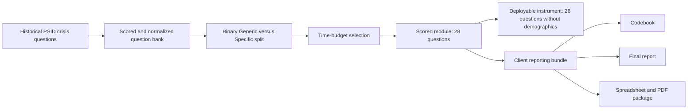

# Client 3 - Final Report

Prepared for client review  
Updated: April 2026

Portable PDF source: `docs/latex/client_3_final_report.tex`  
Compiled report: `deliverables/Client_3_Final_Report.pdf`

## 1. Executive Summary

This final report explains the refreshed PSID crisis-module package in stakeholder terms. The package now uses a simpler category model, a cleaner deployable questionnaire, and a more defensible explanation of why some items survive the final shortlist.

The current production run starts from 52 historical questions and produces a 28-question scored module. The client-facing category model has been simplified to two labels only:

- `Generic`
- `Specific`

The earlier practice of presenting `Financial Crisis` as a separate final category has been removed. Financial items now compete inside the broader `Specific` bank alongside disaster and pandemic items.

## 2. Headline Results

| Metric | Value |
| --- | ---: |
| Total ranked questions | 52 |
| Selected scored questions | 28 |
| Deployable questions | 26 |
| Selected scored minutes | 29.98 |
| Deployable minutes | 28.82 |
| Generic rows | 3 |
| Specific rows | 49 |
| Average Ri | 2.201 |
| Maximum Ri | 5.667 |
| Average Pi | 2.561 |
| Maximum Pi | 7.860 |

## 3. Figures

### 3.1 Binary category distribution


### 3.2 Time-budget allocation


### 3.3 Utility-versus-burden view


### 3.4 Top-ranked items


## 4. Reporting Pipeline



## 5. Methodology in Plain Language

### 5.1 How ranking works

Each question receives:

- a utility score for crisis relevance
- a burden score for length and complexity
- a baseline efficiency score `Ri`
- an augmented priority score `Pi` that rewards distinctiveness and construct coverage

The main formulas are:

$$
R_i = \frac{U_i}{B_i}
$$

$$
B_i = \max(0.10 \times \text{word\_count} + 0.20 \times \text{complexity}, 0.1)
$$

$$
P_i = \frac{\text{augmented\_utility}}{B_i \times (1 + 0.65 \times \text{redundancy\_scaled})}
$$

### 5.2 How the binary category is assigned

The client requested a simple threshold:

```text
If Ri >= 0.7 -> Generic
Else -> Specific
```

On the refreshed corpus, that raw rule would not work because all 52 rows already satisfy `Ri >= 0.7`. The workflow therefore applies the client cutoff to normalized `Ri` instead.

$$
\text{ri\_threshold\_score} = \frac{R_i - \min(R_i)}{\max(R_i) - \min(R_i)}
$$

Operational rule:

```text
If ri_threshold_score >= 0.70 -> Generic
Else -> Specific
```

## 6. Threshold Diagnostics

| Diagnostic | Value |
| --- | ---: |
| Minimum raw `Ri` | 0.818 |
| Maximum raw `Ri` | 5.667 |
| Rows with raw `Ri >= 0.70` | 52 of 52 |
| Rows with normalized `ri_threshold_score >= 0.70` | 3 of 52 |

This is why the current `Generic` bucket is intentionally small: it contains only the most portable high-signal items after normalization.

## 7. Selected Module Composition

| Final category | Source | Selected questions | Minutes | Average Ri | Average Pi |
| --- | --- | ---: | ---: | ---: | ---: |
| Generic | COVID-19 | 3 | 1.40 | 5.333 | 7.125 |
| Specific | Hurricane Katrina 2007 | 14 | 20.30 | 2.617 | 2.769 |
| Specific | COVID-19 | 5 | 2.92 | 3.364 | 4.393 |
| Specific | Govt Shutdown Income | 3 | 2.33 | 3.326 | 4.482 |
| Specific | Govt Shutdown Crisis | 1 | 1.87 | 3.719 | 4.592 |
| Specific | Understanding Society | 2 | 1.17 | 1.447 | 2.329 |

## 8. Why Financial Questions Do Not Dominate the Final Module

The earlier output looked more finance-heavy than the current one for two reasons:

1. `Financial Crisis` used to appear as its own visible final label.
2. Multiple finance-related items were close variants of one another, which made the previous structure look broader than it really was.

In the refreshed package:

- financial items compete within `Specific` instead of standing alone as a final category
- redundancy penalties reduce the advantage of repeating near-identical income questions
- Katrina disaster items contribute many strong direct-exposure and trauma items
- the three highest-portability generic items still capture crisis-related financial disruption without making finance the entire story

## 9. Demographic Note

| Group | Rows | Average Ri | Average Pi |
| --- | ---: | ---: | ---: |
| Demographics only | 3 | 1.354 | 2.189 |
| Non-demographic crisis items | 49 | 2.253 | 2.584 |

Interpretation:

- Demographic rows provide context and traceability.
- They are not as efficient as direct crisis-impact questions for the deployable instrument.
- That is why the final scored module can retain them while the deployable questionnaire removes them.

## 10. Worked Example of a High-Value Generic Item

Example question: `GEN_EXPERIENCED_FINANCIAL_DIFFICULTIES_C`

| Field | Value | Meaning |
| --- | ---: | --- |
| `Ri` | 5.667 | Very high baseline signal per unit of burden |
| `Pi` | 7.187 | Strong augmented priority after distinctiveness adjustments |
| `minutes` | 0.35 | Short enough to include in the universal core |
| Final category | `Generic` | Portable across crisis types |

This is the kind of item the new `Generic` bucket is meant to preserve: short, portable, and strongly informative.

## 11. Deliverables for Client Use

| Deliverable | Use |
| --- | --- |
| `client 1.md` | Technical Markdown codebook with formulas, figures, schema, and workflow notes |
| `client 2.md` | Markdown deployable questionnaire with live question tables and universe rules |
| `client 3.md` | Markdown final report for stakeholder circulation |
| `Master_Questionnaire.xlsx` | Full internal review sheet with traceability fields |
| `Deployable_Questionnaire.pdf` | Final deployable PDF questionnaire |
| `Codebook.pdf` | Rendered technical codebook PDF |
| `Final_Report.pdf` | Rendered stakeholder-facing PDF report |

## 12. Conclusion

The refreshed package is more disciplined than the earlier version in three ways:

- it keeps the category model easy to explain
- it preserves the quantitative ranking logic instead of replacing it with ad hoc manual pruning
- it cleanly separates technical documentation, deployable wording, and stakeholder reporting

The result is a client package that is easier to defend analytically and easier to use operationally.